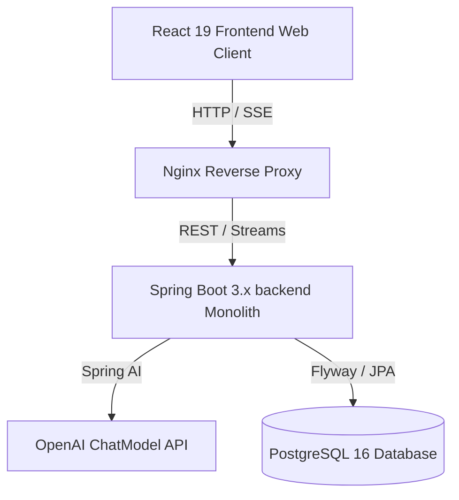

# Architecture & Design Document

ProcessPro is designed as a Modular Monolith with a React 19 Frontend.

## Component Overview



---

## Permitted Package Dependency Flow
The codebase implements strict layer boundaries as documented in [package-dependency.md](file:///d:/New%20folder%20(4)/processpro/docs/package-dependency.md):

```
Controller -> Service -> Mapper -> Repository -> Entity
```

- **Controller**: Exposes REST endpoints, validates input DTOs, and returns standard `ApiResponse<T>` wrappers.
- **Service**: Implements transactional business rules. Does not expose entities directly (exchanges only DTO records).
- **Mapper**: Uses MapStruct to convert entities to DTOs.
- **Repository**: Database querying abstractions.

---

## Graph generation pipeline
1. **PromptBuilder**: Generates domain prompts matching schema definitions and injecting approved symbol lists.
2. **AiService**: Contacts OpenAI ChatModel with JSON response options.
3. **SymbolService**: Enriches raw components with SVG symbols, tags, and confidence scores.
4. **LayoutService**: Arranges components horizontally/vertically utilizing a level-based BFS.
5. **ScenarioService**: Generates default stopper state records.
6. **DiagramHistory**: Persists deep-merged graph layout snapshots to DB.
