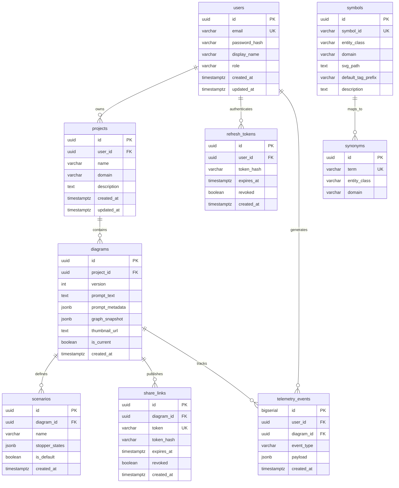

# Database Design Document: AI-Powered Technical Process Map Generator

## 1. Database Overview

### 1.1 Purpose
The database serves as the persistent storage engine for the ProcessPro SaaS platform. It manages structured transactional entities (users, projects, scenarios, permissions) alongside semi-structured, graph-based technical process map schematics (`graph_snapshot`).

### 1.2 Design Principles
- **Hybrid Relational + JSONB Architecture**: Relational integrity and foreign key constraints govern user management, authorization, and project hierarchies, while complex graph topologies (nodes, edges, anchor points, visual coordinates) are stored in PostgreSQL `JSONB` columns to enable atomic reads/writes without complex multi-table JOINs (ADR-003, ADR-008).
- **Strict Referential Integrity**: Cascade delete rules are strictly enforced from user downwards to projects, diagrams, and operational scenarios to prevent orphaned records.
- **Stateless & Immutable Snapshots**: Diagram modifications spawn new diagram version snapshots (`version` counter, `is_current` flag) rather than overwriting historical states in-place.
- **High Read Throughput for Assets**: Engineering symbols and domain synonyms are seeded into read-only lookup tables for fast O(1) matching during AI entity resolution.

### 1.3 Naming Conventions
- **Tables & Columns**: `snake_case`, plural table names (`users`, `projects`, `diagrams`, `scenarios`, `share_links`, `refresh_tokens`, `telemetry_events`, `symbols`, `synonyms`).
- **Primary Keys**: `id` UUID across all relational entities (generated via `gen_random_uuid()`), except telemetry logs which use `BIGSERIAL` for high-ingestion efficiency.
- **Foreign Keys**: `<singular_table_name>_id` (e.g., `user_id`, `project_id`, `diagram_id`).
- **Timestamps**: `created_at`, `updated_at` stored with timezone (`TIMESTAMPTZ DEFAULT NOW()`).

---

## 2. Entity Relationship Diagram (ERD)



---

## 3. Tables & Schema Definitions

### 3.1 `users`
Stores user account records and credentials.
- **Purpose**: Identity and authentication management.
- **Columns**: `id` (UUID PK), `email` (VARCHAR 320 UNIQUE), `password_hash` (VARCHAR 72), `display_name` (VARCHAR 100), `role` (VARCHAR 20), `created_at` (TIMESTAMPTZ), `updated_at` (TIMESTAMPTZ).

### 3.2 `projects`
Stores user-created engineering project containers.
- **Purpose**: Grouping diagrams by engineering domain.
- **Columns**: `id` (UUID PK), `user_id` (UUID FK), `name` (VARCHAR 255), `domain` (VARCHAR 20), `description` (TEXT), `created_at` (TIMESTAMPTZ), `updated_at` (TIMESTAMPTZ).

### 3.3 `diagrams`
Stores individual process map versions and graph snapshots.
- **Purpose**: Canonical graph model persistence and version history.
- **Columns**: `id` (UUID PK), `project_id` (UUID FK), `version` (INT), `prompt_text` (TEXT), `prompt_metadata` (JSONB), `graph_snapshot` (JSONB), `thumbnail_url` (TEXT), `is_current` (BOOLEAN), `created_at` (TIMESTAMPTZ).

### 3.4 `scenarios`
Stores operational simulation presets for diagrams (e.g., normal operation, valve isolation).
- **Purpose**: Persistent simulation state management.
- **Columns**: `id` (UUID PK), `diagram_id` (UUID FK), `name` (VARCHAR 100), `stopper_states` (JSONB), `is_default` (BOOLEAN), `created_at` (TIMESTAMPTZ).

### 3.5 `share_links`
Stores shareable read-only access tokens for public/reviewer viewing.
- **Purpose**: Public URL generation with security expiry.
- **Columns**: `id` (UUID PK), `diagram_id` (UUID FK), `token` (VARCHAR 64 UNIQUE), `token_hash` (VARCHAR 72), `expires_at` (TIMESTAMPTZ), `revoked` (BOOLEAN), `created_at` (TIMESTAMPTZ).

### 3.6 `refresh_tokens`
Stores hashed authentication refresh tokens.
- **Purpose**: JWT session refresh rotation.
- **Columns**: `id` (UUID PK), `user_id` (UUID FK), `token_hash` (VARCHAR 72), `expires_at` (TIMESTAMPTZ), `revoked` (BOOLEAN), `created_at` (TIMESTAMPTZ).

### 3.7 `telemetry_events`
Stores audit logs, AI extraction metrics, and user overrides.
- **Purpose**: System analytics and AI feedback loop.
- **Columns**: `id` (BIGSERIAL PK), `user_id` (UUID FK), `diagram_id` (UUID FK), `event_type` (VARCHAR 50), `payload` (JSONB), `created_at` (TIMESTAMPTZ).

### 3.8 `symbols`
Registry of all 100 MVP engineering component classes and their SVG standards.
- **Purpose**: Domain-aware symbol lookup.
- **Columns**: `id` (UUID PK), `symbol_id` (VARCHAR 100 UNIQUE), `entity_class` (VARCHAR 100), `domain` (VARCHAR 20), `svg_path` (TEXT), `default_tag_prefix` (VARCHAR 20), `description` (TEXT).

### 3.9 `synonyms`
Maps technical phrasing variants and aliases to canonical entity classes.
- **Purpose**: Fuzzy matching and AI parsing normalization.
- **Columns**: `id` (UUID PK), `term` (VARCHAR 100 UNIQUE), `entity_class` (VARCHAR 100), `domain` (VARCHAR 20).

---

## 4. JSONB Design & Graph Representation

### 4.1 Sample `graph_snapshot` Document (React Flow Compatible)
The canonical multi-graph topology is stored as a structured, React Flow compatible JSON object inside `graph_snapshot`:

```json
{
  "schemaVersion": "1.0",
  "metadata": {
    "domain": "industrial",
    "nodeCount": 4,
    "edgeCount": 3,
    "extractedAt": "2026-06-29T22:30:00Z",
    "layoutPreset": "process-flow"
  },
  "nodes": [
    {
      "id": "n1",
      "type": "customNode",
      "position": { "x": 100, "y": 200 },
      "data": {
        "label": "Water Reservoir",
        "entityClass": "RESERVOIR",
        "symbolId": "RESERVOIR",
        "symbolSvgPath": "/assets/symbols/industrial/reservoir.svg",
        "confidence": 0.98,
        "userConfirmRequired": false,
        "tag": "TK-101",
        "orientation": "horizontal"
      },
      "width": 100,
      "height": 80,
      "locked": false
    },
    {
      "id": "n2",
      "type": "customNode",
      "position": { "x": 320, "y": 200 },
      "data": {
        "label": "Centrifugal Feed Pump",
        "entityClass": "CENTRIFUGAL_PUMP",
        "symbolId": "CENTRIFUGAL_PUMP",
        "symbolSvgPath": "/assets/symbols/industrial/pump_centrifugal.svg",
        "confidence": 0.95,
        "userConfirmRequired": false,
        "tag": "P-101",
        "orientation": "horizontal"
      },
      "width": 80,
      "height": 80,
      "locked": true
    },
    {
      "id": "n3",
      "type": "customNode",
      "position": { "x": 520, "y": 200 },
      "data": {
        "label": "Isolation Gate Valve",
        "entityClass": "GATE_VALVE",
        "symbolId": "GATE_VALVE",
        "symbolSvgPath": "/assets/symbols/industrial/valve_gate.svg",
        "confidence": 0.97,
        "userConfirmRequired": false,
        "tag": "GV-101",
        "orientation": "horizontal"
      },
      "width": 60,
      "height": 60,
      "locked": false
    },
    {
      "id": "n4",
      "type": "customNode",
      "position": { "x": 700, "y": 200 },
      "data": {
        "label": "Storage Tank T-102",
        "entityClass": "STORAGE_TANK",
        "symbolId": "STORAGE_TANK",
        "symbolSvgPath": "/assets/symbols/industrial/tank_storage.svg",
        "confidence": 0.96,
        "userConfirmRequired": false,
        "tag": "T-102",
        "orientation": "horizontal"
      },
      "width": 120,
      "height": 100,
      "locked": false
    }
  ],
  "edges": [
    {
      "id": "e1",
      "source": "n1",
      "target": "n2",
      "type": "customEdge",
      "data": {
        "medium": "liquid",
        "direction": "forward",
        "label": "Suction Line",
        "routePoints": [
          { "x": 200, "y": 240 },
          { "x": 320, "y": 240 }
        ],
        "labelPosition": { "x": 260, "y": 230 }
      }
    },
    {
      "id": "e2",
      "source": "n2",
      "target": "n3",
      "type": "customEdge",
      "data": {
        "medium": "liquid",
        "direction": "forward",
        "label": "Discharge Line",
        "routePoints": [
          { "x": 400, "y": 240 },
          { "x": 520, "y": 240 }
        ],
        "labelPosition": { "x": 460, "y": 230 }
      }
    },
    {
      "id": "e3",
      "source": "n3",
      "target": "n4",
      "type": "customEdge",
      "data": {
        "medium": "liquid",
        "direction": "forward",
        "label": "Process Feed",
        "routePoints": [
          { "x": 580, "y": 240 },
          { "x": 700, "y": 240 }
        ],
        "labelPosition": { "x": 640, "y": 230 }
      }
    }
  ]
}
```

### 4.2 `stopper_states` Structure (`scenarios` table)
Maps node IDs to active operational/interlock states:
```json
{
  "n3": "closed"
}
```

### 4.3 Versioning Strategy
Every `graph_snapshot` includes `"schemaVersion": "1.0"`. When schema enhancements occur in future phases (e.g., adding physics attributes), Java's `GraphSerializer` performs transparent forward migration on read without requiring high-risk SQL database migrations.

---

## 5. Indexing Strategy

1. **B-Tree Indexes**: Applied on all primary keys, unique natural keys (`users.email`, `synonyms.term`, `symbols.symbol_id`, `share_links.token`), and foreign key relationships (`user_id`, `project_id`, `diagram_id`) to accelerate JOIN operations and owner checks.
2. **Composite B-Tree Index**: `idx_symbols_domain_class` on `(domain, entity_class)` for instant symbol lookups during entity resolution.
3. **GIN (Generalized Inverted Index)**: `idx_diagrams_graph` on `diagrams USING GIN (graph_snapshot)`. Enables fast JSONPath filtering across stored graphs (e.g., querying diagrams containing specific equipment types).

---

## 6. Cascade Rules & Referential Integrity

- **`projects.user_id` -> `users.id` (ON DELETE CASCADE)**: When a user account is deleted, all owned projects are removed.
- **`diagrams.project_id` -> `projects.id` (ON DELETE CASCADE)**: Deleting a project automatically removes all associated diagrams and version histories.
- **`scenarios.diagram_id` & `share_links.diagram_id` -> `diagrams.id` (ON DELETE CASCADE)**: Scenarios and share tokens are strictly bound to diagram revisions and are cleaned up when a diagram version is removed.
- **`telemetry_events.user_id` & `diagram_id` (ON DELETE SET NULL)**: Telemetry logs are preserved for system analytics even if the originating user or diagram is deleted.

---

## 7. Audit Fields & Soft Delete Strategy

### 7.1 Audit Fields
Standard audit fields `created_at` and `updated_at` with timezone markers (`TIMESTAMPTZ`) are included on core domain tables (`users`, `projects`, `diagrams`, `scenarios`). `updated_at` is managed automatically via application-level Spring Data JPA `@UpdateTimestamp`.

### 7.2 Soft Delete Strategy
For the MVP, **hard deletion with CASCADE** is used for user project workflows to maintain a clean database footprint and simplified query structures. Soft delete (`is_deleted` flag) is explicitly out of scope for MVP and reserved for Phase 2 Enterprise offerings.

---

## 8. Planned Flyway Migration Sequence

To ensure clean separation between schema creation, constraint optimization, and dataset initialization, database setup will be executed across 5 modular Flyway migrations in `/backend/src/main/resources/db/migration/`:

- **`V1__initial_schema.sql`**: Baseline table creation (`users`, `projects`, `diagrams`, `scenarios`, `share_links`, `refresh_tokens`, `telemetry_events`).
- **`V2__constraints_and_indexes.sql`**: Foreign key constraints, unique constraints, and B-tree/GIN index definitions.
- **`V3__symbol_registry.sql`**: Lookup structure creation (`symbols`, `synonyms` tables and composite lookup indexes).
- **`V4__seed_symbols.sql`**: Seeds all 100 MVP engineering component classes across Industrial, Electrical, and Hydraulic domains.
- **`V5__seed_synonyms.sql`**: Seeds >30 common engineering term aliases for fuzzy resolution.

---

## 9. Performance Considerations & Optimization
1. **Connection Pooling**: HikariCP configured with `maximum-pool-size: 10` for high-throughput concurrency.
2. **O(1) Memory Graph Lookup**: Graph models are loaded atomically in a single SELECT query using `graph_snapshot` JSONB, bypassing N+1 relational query traps.
3. **Optimized GIN Indexing**: JSONB queries leverage GIN indexing to maintain fast response times under multi-tenant load.
