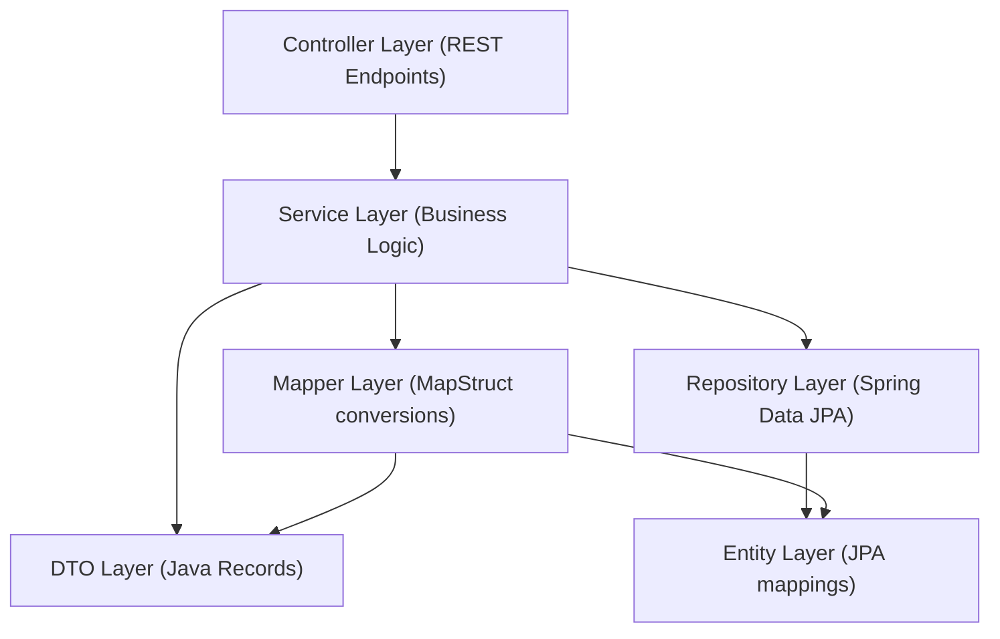

# Package Dependency Guidelines: Clean Architecture Rules

To maintain high maintainability, testability, and decouple domain logic from presentation or database concerns, ProcessPro enforces strict package dependency flows based on Clean Architecture principles.

---

## 1. Permitted Dependency Flow

The allowed dependency direction is **outermost (Controller) to innermost (Entity/DTO)**:



- **Controller**: Initiates request processing. Resolves authorization, accepts inputs, and delegates immediately to a `@Service` bean.
- **Service**: Implements business logic, transaction boundaries (`@Transactional`), and handles database access via Repository. Invokes Mappers to convert entities to DTOs.
- **Mapper**: Compiles MapStruct interfaces to convert between JPA entities and transfer-optimized DTO records.
- **Repository**: Provides raw database operations. Handled only by the Service layer.
- **Entity & DTO**: Pure data containers (Entities map database tables; DTOs format API request/response payloads).

---

## 2. Forbidden Dependency Flows

The following dependency directions are **strictly prohibited** and will cause pull request failures:

```
[X] Controller --> Repository   (Skip service layer bypasses business logic & transactions)
[X] Controller --> Entity       (API clients should never directly receive JPA entities)
[X] DTO --> Repository          (Data containers must not hold database access logic)
[X] Repository --> Service      (Circular dependency risk)
[X] Service A --> Repository B  (Cross-module repository access; must go through Service B interface)
[X] Entity --> DTO              (Innermost domain must not depend on outer API models)
```

---

## 3. Class Naming & Architecture Design Rules

- **Controllers**: Named `<Domain>Controller.java`, annotated with `@RestController` and `@RequestMapping("/api/v1/...")`. No SQL queries or logic inside.
- **Services**: Named `<Domain>Service.java`, annotated with `@Service`. Must inject dependencies via constructor injection only.
- **Repositories**: Named `<Domain>Repository.java`, extending `JpaRepository`.
- **Mappers**: Named `<Domain>Mapper.java` with MapStruct `@Mapper(componentModel = "spring")`.
- **DTOs**: Named `<Action>RequestDTO.java` or `<Domain>ResponseDTO.java`.
